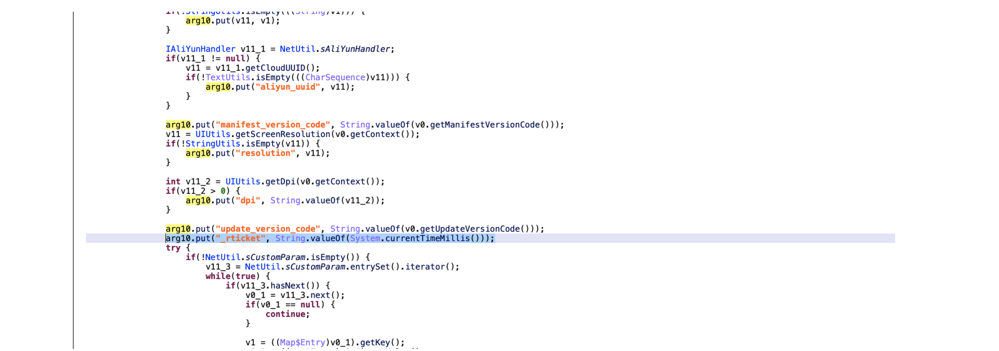
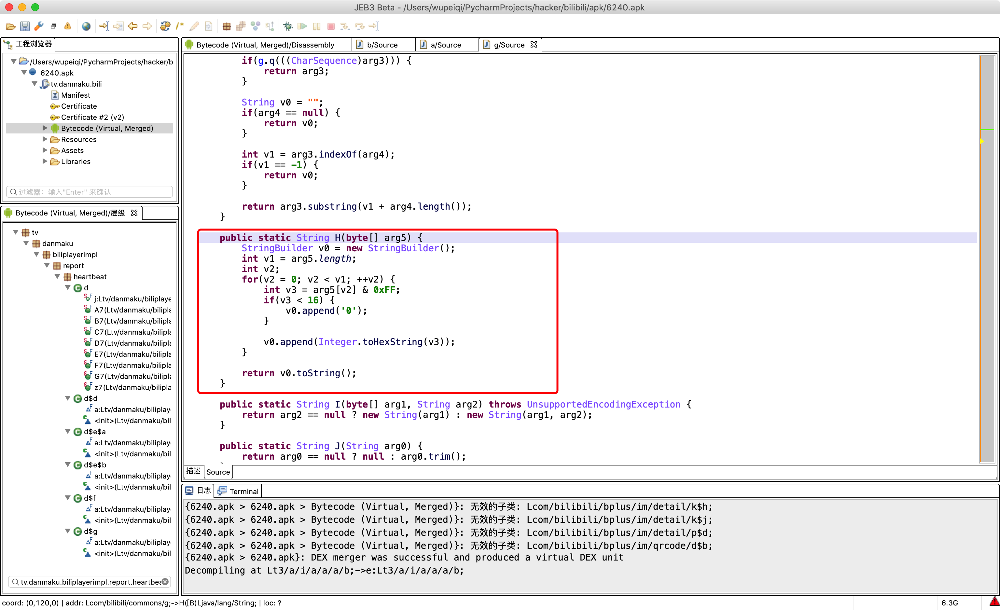
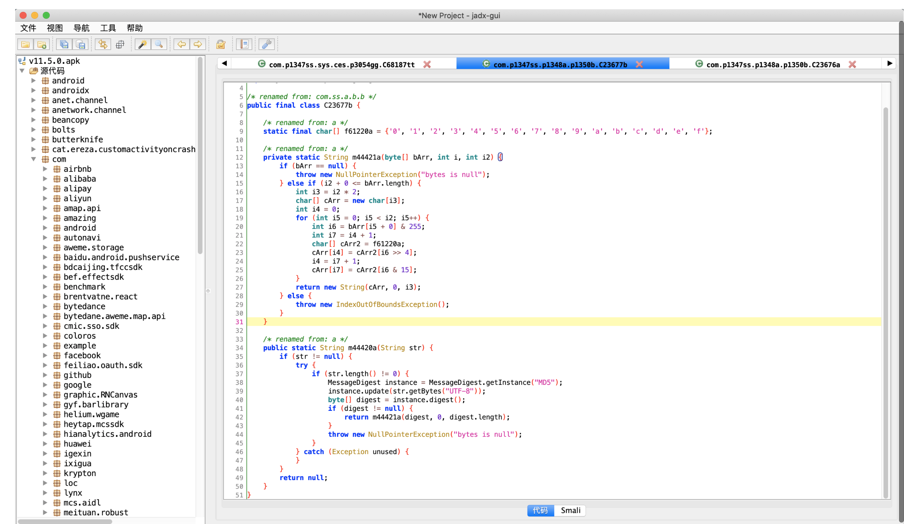
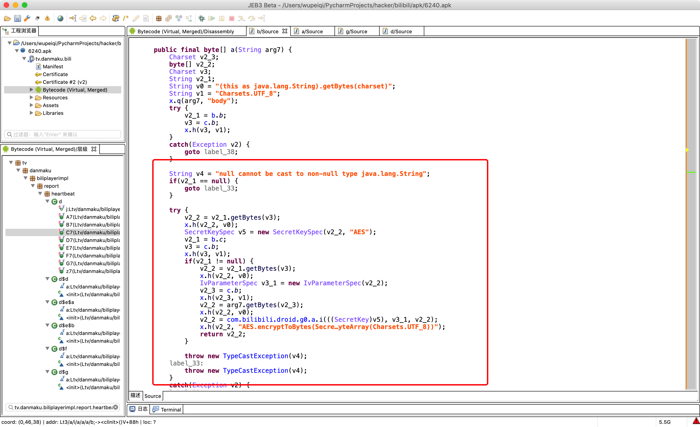

# day07 Java和安卓环境

今日概要：

- Java常见加密（Java -> python实现 ）

- 安卓开发（基于java做安卓app开发）

  - 环境搭建
  - 快速上手


```
- 安卓基础：页面数据 + 网络请求 + 数据存储 + 常见语句 -> 正常安卓开发 -> Java层面
- 安卓进阶（JNI开发）
	- 基础，基于Java开发，简单算法基于Java实现。
	- C语言（xxx.so），反编译so文件从而得到C语言的代码。
```


## 1.Java常见加密


### 1.1 隐藏字节

逆向时看到了关键字，可能会直接去搜索，好的情况是直接能搜到，不好的情况是，其关键字是一个字节数组再转为字符串的形式，这样是直接搜不到的，字节就隐藏起来了。

```java
// java中字典要放键值对，是要传输给后端的值
TreeMap map = new TreeMap();
// 这是简单情况下。直接能搜到关键字
map.put("sign",x);

# 搜索关键字 sign
```

```java
// 字符串直接搜，是搜不到的，a字节数组表示字符串
String a = new String(new byte[]{-26, -83, -90, -26, -78, -101, -23, -67, -112});
TreeMap map = new TreeMap();
map.put(a,x);
    
# hook机制，找到TreeMap中的put方法，替换成我自己的某个方法。hook之后再调用TreeMap的put方法就会执行我们替换之后的方法，走到我们自己的函数中。
function newPut(key,value){
    console.log(key,value);   // 看输出的值，找到关键字，再去获取调用栈。
    
}
```

总结思路：

- 在搜索关键字搜索不到时，可以尝试hook一下Map系列的put方法来找


对于加密时候的盐可能是字符串，也可能是字节数组。

```java
String salt = "xxssasdfasdfadsf";
```

```java
String v4 = new String(new byte[]{-26, -83, -90, -26, -78, -101, -23, -67, -112});
```

python代码实现字节数组到字符串，需要先做一把转换，因为python中字节表示范围没有负数，要将java的字节转为python的字节

- 示例1：

  ```java
  String v1 = new String(new byte[]{26, 83, 90, 26, 78, 101, 23, 67, 112});
  ```

  在java代码中看到上面的字节数组，把 字节数组直接拷贝到下面python代码中，就能直接知道其字符串的内容是啥了

  ```python
  # 字节列表
  byte_list = [26, 83, 90, 26, 78, 101, 23, 67, 112]
  
  # 字节列表 -> python的字节数组
  bs = bytearray()
  for item in byte_list:
      bs.append(item)
      
  # python的字节数组 -> 编码 -> 字符串
  str_data = bs.decode('utf-8')
  print(str_data)
  ```

- 示例2：

  ```java
  String v4 = new String(new byte[]{-26, -83, -90, -26, -78, -101, -23, -67, -112});
  // 对于java中有的有符号值必须先转为python的无符号值在进行操作
  
  # java字节：有符号 -128 ~ 127
  # python：无符号  0 ~ 255
  ```

  ```python
  byte_list = [-26, -83, -90, -26, -78, -101, -23, -67, -112]
  
  bs = bytearray()  # python字节数组
  for item in byte_list:
      if item < 0:
          item = item + 256
      bs.append(item)
  
  str_data = bs.decode('utf-8')  # data = bytes(bs)
  print(str_data)
  ```

  

```
注意事项：什么编码？（utf-8)
	String v4 = new String(new byte[]{-26, -83, -90, -26, -78, -101, -23, -67, -112});
```

```python
# 类似于Java中的字节数组
data = "张三懵逼了"
data_bytes = data.encode('utf-8')


data_list = bytearray()
for item in data_bytes:
    data_list.append(item)

res = data_list.decode('utf-8')
print(res)
```


提醒：MD5加密盐、AES加密key、iv;


### 1.2 uuid

抖音udid


```java
import java.util.UUID;

public class Hello {
    public static void main(String[] args){
        // java中有生成uuid的函数，如下
        String uid = UUID.randomUUID().toString();
        System.out.println(uid);
    }
}
```

对应到python中：

```python
import uuid

uid = str(uuid.uuid4())
print(uid)
```

```
29cd5f50-4b4c-457b-9a59-33a12e3edd10
```

在app逆向中使用uuid的两个场景：

```
1.第一类使用uuid
	抓包发现，每次请求值不一样：d7cb3695-5105-4aaa-b0a8-8188e0977143
	可以直接使用python来模拟

2.第一次运行生成UUID
在请求中uuid都是不变的：在关闭应用，关机，重新打开应用，发现这个uuid值是不变的。这不是个固定的值。
其逻辑如下：
	- 刚开始运行：调用uuid算法生成一个值。
	- 写入XML文件
	- 再使用
		- 优先去XML文件中找
		- uuid算法

	如果想看其是否变化，进行下面测试：
		- 清除app数据，找到对应的app，会有清除数据的选项
		- 必须卸载app，重新安装
	在逆向这种时，可以找有没有xml文件，xml文件中看uuid
	
	

		
```


### 1.3 随机值

抖音：openudid


```java
import java.math.BigInteger;
import java.security.SecureRandom;

public class Hello {

    public static void main(String[] args) {
        // 随机生成80位，也就是10个字节（8位一个字节）
        BigInteger v4 = new BigInteger(80, new SecureRandom());
        // 让字节以16进制展示
        String res = v4.toString(16);
        System.out.println(res);

    }
}
```

用python模拟java中随机生成字节

```python
import random

data = random.randbytes(10)  # pytho3.9

ele_list = []
for item in data:
    # 184    十进制  -> 十六进制
    # hex(item)  # 
    ele = hex(item)[2:]
res = "".join(ele_list)
print(res)
```

```python
data = "".join([ hex(item)[2:] for item in random.randbytes(10)])
```


#### 小补充：十六进制

```python
import random

data = random.randbytes(10)  # pytho3.9

ele_list = []
for item in data:
    # 不满两位必须补齐两位，hex(5)=>'0x5',这种情况必须注意
    ele = hex(item)[2:].rjust(2,"0")
res = "".join(ele_list)
print(res)
```

```python
data = "".join([ hex(item)[2:].rjust(2,"0") for item in random.randbytes(10)])
```


转换十六进制字符串：

- 内置函数

  ```
  v1 = hex(199)
  
  '0xc7'
  ```

- 字符串格式化

  ```
  v2 = "%x" %(199,)
  
  'c7'
  ```

  ```python
  v3 = "%02x" %(5,)
  
  '05'
  ```


```python
import random

data = random.randbytes(10)

ele_list = []
for item in data:
    ele = "%02x" %(item,)
    ele_list.append(ele)

res = "".join(ele_list)
print(res)

open_udid = "".join(["%02x" % i for i in random.randbytes(10)])
print(open_udid)
```


### 1.4 时间戳

抖音：_ticket



```java
public class Hello {

    public static void main(String[] args) {
        String t1 = String.valueOf(System.currentTimeMillis() / 1000);
        String t2 = String.valueOf(System.currentTimeMillis());

        System.out.println(t1);
        System.out.println(t2);
    }
}
```

```python
import time

v1 = int(time.time())
v2 = int(time.time()*1000)
```

```
v1 = str(int(time.time()))
v2 = str(int(time.time()*1000))
```


### 1.5 十六进制的字符串





在Java中字节是有符号：-128 ~ 127 

python中将java拿到的字节数组转为16进制字符串

```python
# name_bytes = "武沛齐".encode('utf-8')
name_bytes = [10, -26, -83, -90, -26, -78, -101, -23, -67, -112]

data_list = []

for item in name_bytes:
    item = item & 0xff   # item<0时，让item+256
    ele = "%02x" % item
    data_list.append(ele)
    
print("".join(data_list))
```


### 1.6 md5加密

python的md5加密，有两种方式得到md5加密的结果

- hexdigest 直接返回的是16进制的字符串
- digest 返回的是字节

```python
import hashlib

obj = hashlib.md5()
obj.update('xxxxx'.encode('utf-8'))

# java中没有这个功能。
v1 = obj.hexdigest()
print(v1) # fb0e22c79ac75679e9881e6ba183b354

v2 = obj.digest()  # 返回字节，在python中不方便使用，所以python中常用hexdigest
print(v2) # b'\xfb\x0e"\xc7\x9a\xc7Vy\xe9\x88\x1ek\xa1\x83\xb3T'
```


抖音：X-SS-STUB

```
每次发送POST请求时，抖音都会携带一些请求头：
	X-SS-STUB = "fjaku9asdf"

读取请求体中的数据，对请求体中的数据进行md5加密。
```



在java中只有`digest`，返回字节数组，需要自己写方法将其转换为16进制字符串

```java
import java.security.MessageDigest;
import java.security.NoSuchAlgorithmException;
import java.util.Arrays;
import java.util.Base64;

public class Hello {

    public static void main(String[] args) throws NoSuchAlgorithmException {
        String name = "武沛齐";
        
        MessageDigest instance = MessageDigest.getInstance("MD5");
        byte[] nameBytes = instance.digest(name.getBytes());
        // System.out.println(Arrays.toString(nameBytes));

        // String res = new String(nameBytes);
        // System.out.println(res);

        // 十六进制展示
        StringBuilder sb = new StringBuilder();
        for(int i=0;i<nameBytes.length;i++){
            int val = nameBytes[i] & 255;  // 负数转换为正数
            if (val<16){
                sb.append("0");
            }
            sb.append(Integer.toHexString(val));
        }
        String hexData = sb.toString();
        System.out.println(hexData); // e6ada6e6b29be9bd90
    }
}
```

看到一段密文，可以猜测是否是md5，如果不确定，可以去hook`MessageDigest.getInstance`方法来看是什么加密，还可以hook`digest`方法来看生成的字节数组转为密文是不是请求中的数据。

```python
import hashlib

m = hashlib.md5()
m.update("武沛齐".encode("utf-8"))

v1 = m.digest()
print(v1) # b'\x175\x10\x12G$)\xd5-\x0c\r#\xd4h\x17='

v2 = m.hexdigest()
print(v2) # 17351012472429d52d0c0d23d468173d
```


关于加盐：

```java
import java.security.MessageDigest;
import java.security.NoSuchAlgorithmException;
import java.util.Arrays;
import java.util.Base64;

public class Hello {

    public static void main(String[] args) throws NoSuchAlgorithmException {
        String name = "武沛齐";
        MessageDigest instance = MessageDigest.getInstance("MD5");
        instance.update("xxxxxx".getBytes());
        
        byte[] nameBytes = instance.digest(name.getBytes());
        
        System.out.println(Arrays.toString(nameBytes));

        String res = new String(nameBytes);
        System.out.println(res);

        // 十六进制展示
        StringBuilder sb = new StringBuilder();
        for(int i=0;i<nameBytes.length;i++){
            int val = nameBytes[i] & 255;  // 负数转换为正数
            if (val<16){
                sb.append("0");
            }
            sb.append(Integer.toHexString(val));
        }
        String hexData = sb.toString();
        System.out.println(hexData); // e6ada6e6b29be9bd90
    }
}
```

后期看到md5加密时，要关注update了几次，就是加盐了几次，如果update多次，一定要找到所有update的参数，在python中照着加盐顺序来还原。

```java
import hashlib

m = hashlib.md5("xxxxxx".encode('utf-8'))
m.update("武沛齐".encode("utf-8"))

v2 = m.hexdigest()
print(v2) # 17351012472429d52d0c0d23d468173d
```


### 1.7 sha-256加密

和md5一样，就是`MessageDigest.getInstance`的参数不一样

B站：x/report/andriod2，请求体


java实现sha256加密

```java
import java.security.MessageDigest;
import java.security.NoSuchAlgorithmException;
import java.util.Arrays;
import java.util.Base64;

public class Hello {

    public static void main(String[] args) throws NoSuchAlgorithmException {
        String name = "武沛齐";
        MessageDigest instance = MessageDigest.getInstance("SHA-256");
        byte[] nameBytes = instance.digest(name.getBytes());
        // System.out.println(Arrays.toString(nameBytes));

        // String res = new String(nameBytes);
        // System.out.println(res);

        // 十六进制展示
        StringBuilder sb = new StringBuilder();
        for(int i=0;i<nameBytes.length;i++){
            int val = nameBytes[i] & 255;  // 负数转换为正数
            if (val<16){
                sb.append("0");
            }
            sb.append(Integer.toHexString(val));
        }
        String hexData = sb.toString();
        System.out.println(hexData); // e6ada6e6b29be9bd90
    }
}
```

python实现sha256加密

```python
import hashlib

m = hashlib.sha256()
m.update("武沛齐".encode("utf-8"))

v2 = m.hexdigest()
print(v2)
```


### 1.8 AES加密

情景1：

使用时，对数据进行加密得到字节直接发送，以字节的形式直接放在请求体中传递

- 对请求体进行抓包，发现一大堆都是乱的，其实本质上发送的是二进制，只不过抓包软件进行翻译时按照utf-8的编码进行翻译，翻译不出来字符串的。
- 看到一大堆乱的，就要猜测是不是AES加密，发送的是字节数据，发送到后端后，后端直接就能解密AES。

情景2：

进行AES加密得到字节之后，配合base64编码，得到一堆16进制的字符串，放到请求体或者请求头中传递数据到后端


AES加密的Key和Iv是固定的，不是动态的，看到AES加密紧接着去找三个东西(不要怀疑其实动态生成，不要去找是如何算法生成，这玩意一般都是固定死写在代码中的，固定写的不一定在很显眼的位置)：

有时候key和iv藏的比较深，可能是c语言生成的so文件给返回的，所以太深就不要找了，直接hook，输出值来使用

- key，不用找生成的地方，直接hook`SecretKeySpec`的实例化，换成自己的类实例化，实例化时调用自己的，将key一输出，就只到值是什么了，可以直接拿来使用
- iv  同key
- 明文


对称加密

- key & iv ，明文加密。【app端】
- key & iv ，解密。【API】

```
情况1: 请求体密文（抓包乱码）
情况2: sign，AES加密+base64编码
```

刷B站播放时，发送POST请求。

AES加密（请求体中的数据） -> 密文（JS央视频 key & iv & 加密）。




但凡在java代码中看到以下关键字，就是AES加密了

- `new SecretKeySpec`
- `IvParameterSpec`

```java
import javax.crypto.BadPaddingException;
import javax.crypto.Cipher;
import javax.crypto.IllegalBlockSizeException;
import javax.crypto.NoSuchPaddingException;
import javax.crypto.spec.IvParameterSpec;
import javax.crypto.spec.SecretKeySpec;
import java.io.UnsupportedEncodingException;
import java.security.InvalidAlgorithmParameterException;
import java.security.InvalidKeyException;
import java.security.MessageDigest;
import java.security.NoSuchAlgorithmException;
import java.util.Arrays;
import java.util.Base64;

public class Hello {

    public static void main(String[] args) throws Exception {
        String data = "武沛齐";
        String key = "fd6b639dbcff0c2a1b03b389ec763c4b";
        String iv = "77b07a672d57d64c";

        // 加密
        byte[] raw = key.getBytes();
        SecretKeySpec skeySpec = new SecretKeySpec(raw, "AES");
        IvParameterSpec ivSpec = new IvParameterSpec(iv.getBytes());
        
        Cipher cipher = Cipher.getInstance("AES/CBC/PKCS5Padding");
        cipher.init(Cipher.ENCRYPT_MODE, skeySpec, ivSpec);
        byte[] encrypted = cipher.doFinal(data.getBytes());
        
        // System.out.println(Arrays.toString(encrypted));
        
    }
}
```

```python
# pip install pycryptodome
from Crypto.Cipher import AES
from Crypto.Util.Padding import pad

KEY = "fd6b639dbcff0c2a1b03b389ec763c4b"
IV = "77b07a672d57d64c"


def aes_encrypt(data_string):
    aes = AES.new(
        key=KEY.encode('utf-8'),
        mode=AES.MODE_CBC,
        iv=IV.encode('utf-8')
    )
    raw = pad(data_string.encode('utf-8'), 16)
    return aes.encrypt(raw)

data = aes_encrypt("武沛齐")
print(data)
print([ i for i in data])

```


### 1.9 gzip压缩

抖音注册设备的流程：

抖音第一次打开的时候，会进行注册设备的动作，注册设备会获取手机的一些设备信息(mac地址，androidid，iemi)，设备唯一的这些值，这些值会发给抖音，抖音会读取设备信息，会检测这个设备是不是新设备，如果是新设备会返回install_id和device_id这两值会代表是设备id，如果是老设备会将最开始生成的这两个值返回给你。

抖音注册设备：设备。

> 注册设备：生成一些值，值中包括：   （cdid、手机型号、手机品牌....） 后端读取到时候，发现cdid是一个全新的请求。那么抖音就会生成 `device_id、install_id、tt`

第一次打开将设备信息发送给抖音时，会进行gzip压缩

- 读取设备信息
- 对设备信息进行加密，得到密文，密文是字节
- 使用gzip对字节进行压缩
- 压缩完后将数据发送给抖音
  - 请求体中：gzip压缩后的数据
  - 请求头中：对gzip压缩后的数据进行了md5加密

```
（cdid、手机型号、手机品牌....） --> gzip压缩(字节)  --> 加密   -->   密文
```


```java
import java.io.ByteArrayInputStream;
import java.io.ByteArrayOutputStream;
import java.io.IOException;
import java.math.BigInteger;
import java.security.SecureRandom;
import java.util.ArrayList;
import java.util.Arrays;
import java.util.HashMap;
import java.io.OutputStream;
import java.util.zip.GZIPInputStream;
import java.util.zip.GZIPOutputStream;

public class Hello {

    public static void main(String[] args) throws IOException {

        // 压缩
        String data = "武沛齐";
        // System.out.println(Arrays.toString(data.getBytes()));
        ByteArrayOutputStream v0_1 = new ByteArrayOutputStream();
        GZIPOutputStream v1 = new GZIPOutputStream((v0_1));
        v1.write(data.getBytes());
        v1.close();
        
        // [11,22,31,14,45]
        byte[] arg6 = v0_1.toByteArray();  //gzip压缩后：arg6
        // System.out.println(Arrays.toString(arg6));

        // 解压缩
        ByteArrayOutputStream out = new ByteArrayOutputStream();
        ByteArrayInputStream in = new ByteArrayInputStream(arg6);
        GZIPInputStream ungzip = new GZIPInputStream(in);
        byte[] buffer = new byte[256];
        int n;
        while ((n = ungzip.read(buffer)) >= 0) {
            out.write(buffer, 0, n);
        }
        byte[] res = out.toByteArray();
        // System.out.println(Arrays.toString(res));
        System.out.println(out.toString("UTF-8"));

    }
}
```

```python
import gzip


# 压缩
"""
s_in = "我是武沛齐".encode('utf-8')
s_out = gzip.compress(s_in)

print([i for i in s_out])
"""

# 解压缩
"""
res = gzip.decompress(s_out)
print(res)
print(res.decode('utf-8'))
"""
```

提醒：java、Python语言区别。（个别字节是不同，不影响整个的结果），。 


java中gzip压缩后的字节，转为python中的字节时，会和python中对应字符串gzip压缩后的字节有些许不同，将java转为的python字节不同的位置拷贝到pythongzip压缩后的字节位置即可，要验证下。


### 1.10 base64编码

```java
import java.util.Base64;

public class Hello {

    public static void main(String[] args) {
        String name = "武沛齐";
        // 加密
        Base64.Encoder encoder  = Base64.getEncoder();
        String res = encoder.encodeToString(name.getBytes());
        System.out.println(res); // "5q2m5rKb6b2Q"
		
        // 解密
        Base64.Decoder decoder  = Base64.getDecoder();
        byte[] origin = decoder.decode(res);
        String data = new String(origin);
        System.out.println(data); // 武沛齐

    }
}
```

```python
import base64

name = "武沛齐"

res = base64.b64encode(name.encode('utf-8'))
print(res) # b'5q2m5rKb6b2Q'


data = base64.b64decode(res)
origin = data.decode('utf-8')
print(origin) # "武沛齐"
```


## 2.安卓开发（环境搭建）

目标：了解正向开发常见流程（逆向）。

想要开发安卓程序：

- Java语言 + JDK
- 安卓的工具（SDK）+ 类库
- IDE - android studio

SDK不用单独下载，下载安装了android studio会帮你搞定SDK和类库

详细见：环境搭建


