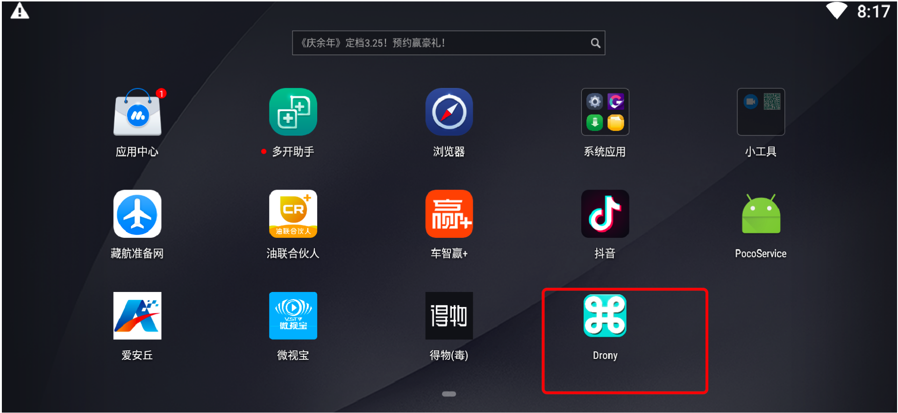

# day09 安卓逆向

今日概要：

- 安卓开发：网络请求

  ```
  - Java基础，看得懂java。
  - 安卓程序，安卓的特点。
  - JNI开发+逆向->C语言。
  ```

- 逆向案例：油联合伙人

- 代码开发规范


## 1.安卓网络请求


```
1.引入，在build.gradle中 implementation "com.squareup.okhttp3:okhttp:4.9.1"
2.配置，在AndroidManifest.xml中 <uses-permission android:name="android.permission.INTERNET"/>
3.支持http（仅测试使用）
```


### 1.1 表单格式

```
user=wupeiqi&age=99&size18
```

```java
new Thread() {
    @Override
    public void run() {
        OkHttpClient client = new OkHttpClient();
        
        FormBody form = new FormBody.Builder()
                .add("user", dataMap.get("username"))
                .add("pwd", dataMap.get("password"))
                .add("sign", dataMap.get("sign")).build();

        Request req = new Request.Builder().url("http://192.168.0.6:9999/login").post(form).build();
        Call call = client.newCall(req);
        try {
            Response res = call.execute();
            ResponseBody body = res.body();
            // 字符串={"status": true, "token": "fffk91234ksdujsdsd", "name": "武沛齐"}
            String dataString = body.string();

            // Log.e("MDS", "请求成功获取返回值=" + dataString);
        } catch (IOException ex) {
            Log.e("MDS", "网络请求错误");
        }
    }
}.start();
```


### 1.2 json格式

```
{
	name:"wupeiqi",
	age:18,
	size:18
}
```

```java
new Thread() {
    @Override
    public void run() {
        OkHttpClient client = new OkHttpClient();
		// TreeMap<String, String> dataMap = new TreeMap<String, String>();
        // dataMap = {"username":"wupeiqi","password":"123","sign":"用户名和密码的md5值"}
        JSONObject json = new JSONObject(dataMap);
        
        //{name:"wupeiqi....}
        String jsonString = json.toString();
         RequestBody form = RequestBody.create(MediaType.parse("application/json;charset=utf-8"),jsonString);

        Request req = new Request.Builder().url("http://192.168.0.6:9999/login").post(form).build();
        Call call = client.newCall(req);
        try {
            Response res = call.execute();
            ResponseBody body = res.body();
            String dataString = body.string();
            Log.i("登录", dataString);
        } catch (IOException e) {
            e.printStackTrace();
        }
    }
}.start();
```


### 1.3 请求拦截器

假设开发app，发送10个请求，每个请求中需要携带特殊的请求头：xxxx。

将所有请求公共的操作都放在拦截器里面。

```java
// 创建拦截器
Interceptor interceptor = new Interceptor() {

    @Override
    public Response intercept(Chain chain) throws IOException {
		// 连接器发送请求，每个请求都会经过intercept方法。
        
        // 额外在这个请求中，添加2个请求投
        Request request = chain.request().newBuilder().addHeader("ts", "1988812212").addHeader("sign", "xxxx").build();

        // 请求前
        Response response = chain.proceed(request);
        // 请求后
        return response;
    }
};


// 4.将三个值：用户名、密码、签名 网络请求发送API（校验）
// okhttp，安装 & 引入 & 使用（创建一个线程去执行）
// 5.获取返回值
new Thread() {
    @Override
    public void run() {
        // 线程执行的内容
        // user=xxx&pwd=xxx&sign=xxxx
        // OkHttpClient client = new OkHttpClient.Builder().build();
        OkHttpClient client = new OkHttpClient.Builder().addInterceptor(interceptor).build();
        FormBody form = new FormBody.Builder()
            .add("user", dataMap.get("username"))
            .add("pwd", dataMap.get("password"))
            .add("sign", dataMap.get("sign")).build();
        Request req = new Request.Builder().url("http://192.168.0.6:9999/login").post(form).build();
        Call call = client.newCall(req);
        try {
            Response res = call.execute();
            ResponseBody body = res.body();
            String dataString = body.string();
            Log.e("请求发送成功", dataString);

        } catch (IOException ex) {
            Log.e("Main", "网络请求异常");
        }
    }
}.start();
```


### 1.4 NO_PROXY

防止系统代理抓包。

```java
new Thread() {
    @Override
    public void run() {
        OkHttpClient client = new OkHttpClient.Builder().proxy(Proxy.NO_PROXY).build();
        //                OkHttpClient client = new OkHttpClient.Builder().build();
        FormBody form = new FormBody.Builder()
            .add("user", dataMap.get("username"))
            .add("pwd", dataMap.get("password"))
            .add("sign", dataMap.get("sign")).build();

        Request req = new Request.Builder().url("http://192.168.0.6:9999/login").post(form).build();
        Call call = client.newCall(req);
        try {
            Response res = call.execute();
            ResponseBody body = res.body();
            // 字符串={"status": true, "token": "fffk91234ksdujsdsd", "name": "武沛齐"}
            String dataString = body.string();
            // Log.e("MDS", "请求成功获取返回值=" + dataString);
        } catch (IOException ex) {
            Log.e("MDS", "网络请求错误");
        }
    }
}.start();
```

默认抓包软件，抓不到了。。。


### 1.5 Drony解决NO_PROXY

安装在手机、模拟器上的一个软件，对你的手机中某些app中的请求进行转发，解决app中设置NO_PROXY的情况。

- Drony-102.apk，【英文版】【安卓低版本】【模拟器】
- Drony-1-3.154.apk，【繁体中文】【手机】





### 1.7 retrofit

内部封装了okhttp，让你用的更加的简单（B站）。

- 引入

  ```
  // implementation "com.squareup.okhttp3:okhttp:4.9.1"
  
  implementation "com.squareup.retrofit2:retrofit:2.9.0"
  ```

- 写接口，声明网络请求

  ```java
  package com.nb.mds;
  
  import okhttp3.RequestBody;
  import okhttp3.ResponseBody;
  import retrofit2.Call;
  import retrofit2.http.Body;
  import retrofit2.http.Field;
  import retrofit2.http.FormUrlEncoded;
  import retrofit2.http.POST;
  import retrofit2.http.GET;
  import retrofit2.http.Query;
  
  public interface HttpReq {
  	
      // 向/api/v1/post 发送POST请求  name=xx&pwd=xxx
      @POST("/api/v1/post")
      @FormUrlEncoded
      Call<ResponseBody> postLogin(@Field("name") String userName, @Field("pwd") String password);
      
      // ->/api/v2/xxx?age=999
      @GET("/api/v2/xxx")
      Call<ResponseBody> getInfo(@Query("age") String age);
  		
      // 向/post/users 发送POST请求 {name:xxxx,age:123}
      @POST("/post/users")
      Call<ResponseBody> postLoginJson(@Body RequestBody body);
  
      @GET("/index")
      Call<ResponseBody> getIndex(@Query("age") String age);
  }
  
  ```

- 发送请求

  ```java
  new Thread() {
      @Override
      public void run() {
          // http://api.baidu.com/api/v2/xxx?age=123
          Retrofit retrofit = new Retrofit.Builder().baseUrl("http://api.baidu.com/").build();
          HttpReq req = retrofit.create(HttpReq.class);
          Call<ResponseBody> call = req.getInfo("123");
          try {
              ResponseBody responseBody = call.execute().body();
              String responseString = responseBody.string();
              Log.e("Retrofit返回的结果", responseString);
  
          } catch (Exception e) {
              e.printStackTrace();
          }
      }
  }.start();
  ```

  ```java
  new Thread() {
      @Override
      public void run() {
          Retrofit retrofit = new Retrofit.Builder().baseUrl("https://www.httpbin.org/").build();
          HttpRequest httpRequest = retrofit.create(HttpRequest.class);		
  		
          // https://www.httpbin.org/api/v1/post  
          // name=xx&pwd=xxx
          Call<ResponseBody> call = httpRequest.postLogin("wupeiqi", "666");
          try {
              ResponseBody responseBody = call.execute().body();
              String responseString = responseBody.string();
              Log.i("登录", responseString);
  
          } catch (Exception e) {
              e.printStackTrace();
          }
      }
  }.start();
  ```

  ```java
  new Thread() {
      @Override
      public void run() {
          Retrofit retrofit = new Retrofit.Builder().baseUrl("https://www.httpbin.org/").build();
          HttpRequest httpRequest = retrofit.create(HttpRequest.class);
  
          JSONObject json = new JSONObject(dataMap);
          String jsonString = json.toString();
          RequestBody form = RequestBody.create(MediaType.parse("application/json;charset=utf-8"),jsonString);
  		
          // https://www.httpbin.org/post/users  
          // {username:"root",password:"123","sign":"xxxxdfsdfsdfsdfdfd"}
          Call<ResponseBody> call = httpRequest.postLoginJson(form);
          try {
              ResponseBody responseBody = call.execute().body();
              String responseString = responseBody.string();
              Log.i("登录", responseString);
  
          } catch (Exception e) {
              e.printStackTrace();
          }
      }
  }.start();
  ```


## 2.案例：油联合伙人


```
请求方式：POST
请求地址：https://chinayltx.com/app/api/v1/partnerLogin/login
请求体：
	phone=18630087660
	password=e10adc3949ba59abbe56e057f20f883e
请求头：
	X-App: native
    X-Noncestr: 123456
    X-OS: partnerApp_android
    X-Req-Time: 1650980779832
    X-Sign: 645b299fc29998e390d60d95a9b1ac5a
    X-Token: 
    X-UserID: 
```

接下来要解决：

- password是怎么加密的？
- X-Sign是怎么加密？


### 2.1 password算法

根据特点去搜索，可能搜到很多东西。

```
password    "password"     password=
phone
/v1/partnerLogin/login
```


按理说md5加密：

- 明文：123456
- 密文：e10adc3949ba59abbe56e057f20f883e

```python
import hashlib

obj = hashlib.md5()
obj.update("123456".encode('utf-8'))
res = obj.hexdigest()
print(res) # e10adc3949ba59abbe56e057f20f883e
```


### 2.2 X-Sign算法

```
X-Sign
```


```python
import hashlib

token = ""
reqTime = "1650980894776"
nonce_str = "123456"
nonce_str_sub_2 = nonce_str[2:]
body_string = "phone=18630087660&password=e10adc3949ba59abbe56e057f20f883e"

encrypt_string = f"{token}{reqTime}{nonce_str_sub_2}{body_string}"

obj = hashlib.md5()
obj.update(encrypt_string.encode('utf-8'))
res = obj.hexdigest()
print(res)


```


## 3.编程规范


### 3.1 关于main

```python
# 全部变量大写
DATA_LIST = []


def run():
    """ 业务逻辑都写在函数 """
    pass


if __name__ == '__main__':
    run()
```


### 3.2 文件操作

别人给你txt文件，读取文件中内容。例如：现在1000个用户名、密码在txt文档中，获取每个用户名、密码进行登录。

```python
# 最不好
def run():
    with open("account.txt", mode='r', encoding='utf-8') as f:
        data_list = f.readlines()

    print(data_list)


if __name__ == '__main__':
    run()

```

```python
# 建议
def run():
    with open("account.txt", mode='r', encoding='utf-8') as f:
        for line in f:
            print(line)


if __name__ == '__main__':
    run()

```

```python
# 建议
def load_file_data():
    with open("account.txt", mode='r', encoding='utf-8') as f:
        for line in f:
            yield line.strip().split(",")  # ["alex","123"]


def run():
    gen_object = load_file_data()
    
    for use, pwd in gen_object:
        print(use, pwd)


if __name__ == '__main__':
    run()

```


### 3.3 并发 

- 多进程，计算密集型程序要用多进程提高并发能力。（需要使用CPU）

- **多线程，IO密集型程序要用多线程提高并发能力。（爬虫） 【线程或线程池】**

- 协程，IO密集型程序要用多线程提高并发能力。（爬虫）  -> 更节省资源->1个线程搞定。

  ```
  - 不要优先用协程写任何的功能。
  - 协程不要太多了，反倒忙了。
  - 线程+协程
  	线程1 + 10
  	线程2 + 10
  	线程3 + 10
  	线程4 + 10
  	线程5 + 10
  - 进程+协程
  	进程1 + 10
  	进程2 + 10
  	进程3 + 10
  	进程4 + 10
  	进程5 + 10
  ```

  


**需求：去注册10w个账号，并写入到文件。**

用锁，影响性能。

```python
import requests
from concurrent.futures import ThreadPoolExecutor
import threading

RLOCK = threading.RLock()


def task(password):
    # 1.requests发请求，给你一个手机（卡商 ）
    res = requests.get(".........")
    phone = res.json()['data']['phone']

    # 2.某平台发送注册
    requests.post(
        url="...",
        data={
            'phone': phone,
            'password': password,
        }
    )
    
	# 3.写入文件
    RLOCK.acquire()
    with open('xxxx.txt', mode='a', encoding='utf-8') as f:
        f.write("{}----{}\n".format(phone, password))
    RLOCK.release()


def run():
    password = "qwe123"
    pool = ThreadPoolExecutor(40)
    for i in range(100000):
        pool.submit(task, password)


if __name__ == '__main__':
    run()
```


**你听过线程都有ID吗？**

```python
import requests
from concurrent.futures import ThreadPoolExecutor
import threading
import os

RLOCK = threading.RLock()


def task(password):
    # 1.requests发请求，给你一个手机（卡商 ）
    res = requests.get(".......")
    phone = res.json()['data']['phone']

    # 2.注册
    requests.post(
        url="...",
        data={
            'phone': phone,
            'password': password,
        }
    )
	
    # 3.文件名
    file_name = "xxxx-{}.txt".format(threading.current_thread().ident)
    with open(file_name, mode='a+', encoding='utf-8') as f:
        f.write(".....")


def run():
    password = "qwe123"
    pool = ThreadPoolExecutor(40)
    for i in range(100000):
        pool.submit(task, password)
    
    # 等待，等待40个线程吧100000个任务全部执行完毕（等待线程池中的任务执行完毕）
	pool.shutdown()
    
    # 获取目录下的所有文件合并
    for name in os.listdir("xxx/xxx/xx/dist"):
        pass

if __name__ == '__main__':
    run()
```


### 3.4 异常+重试

```python
try:

    phone = requests.get('......卡商的API获取手机号').json()['data']

	while True:
        try:
    		v1 = requests.get() # 异常
            break
        except Exceptions as e:
            pass
        
    v2 = request.post()
    v3 = request.post()
except Exceptions as e:
    pass
```

```python
try:

    phone = requests.get('......卡商的API获取手机号').json()['data']

	for i in range(10):
        try:
    		v1 = requests.get() # 异常
            break
        except Exceptions as e:
            pass
	else:
        # for循环中的次数执行完，else中的代码就会执行
        print("请求异常了，请及时处理")
        
    v2 = request.post()
    v3 = request.post()
except Exceptions as e:
    pass
```


### 3.5 反射实现可扩展

基于反射实现可扩展代码，例如：多卡商。

见代码。


