# day10 C语言基础

为什么要学习C语言？

```
一般公司的apk，基于Java实现的加密。   
	-> jadx -> java -> 分析 -> 还原
NB公司的的apk，基于Java+C语言实现加密（JNI开发）。
	-> jadx -> java -> 分析 -> 还原
	-> ida  -> C代码 -> 分析 -> 还原 
		- 逆向，会C语言，Python还原C语言算法
		- unidbg，调用C代码
		- frida-rpc，调用C代码
```

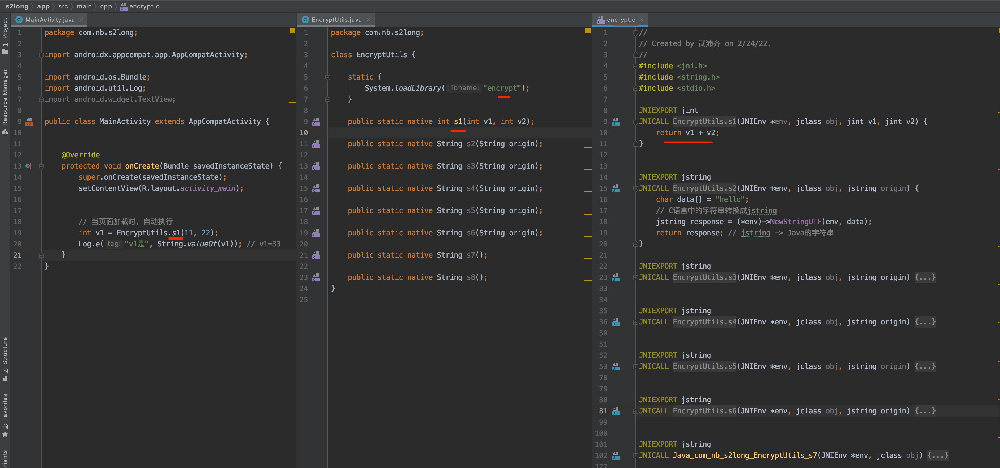


对于我们来讲，就会去反编译C语言实现的算法，反编译后需要读得懂他们的逻辑：

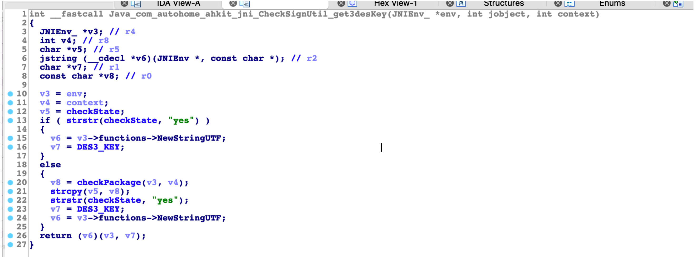


## 1.C语言环境搭建

- 学习语法，写代码
- 编译器或解释器，运行代码。


### 1.1 编译器

学习C语言的语法，编写好代码之后，需要由编译器编译后才能执行。

例如：`main.c`

```c
# include <stdio.h>

int main(int argc, char const *argv[]) {
    printf("hello world\n");
    return 0;
}
```

在终端，使用编译器去编译：

```
>>>gcc main.c
>>>./a.out
```


所以，我们就需要在电脑上把C的编译器安装上，常见的编译器GCC、MSVC、Clang 。

- mac，默认clang（mac用户自带C编译器），如果没有就去直接安装xcode。

  ```
  xcode:  https://developer.apple.com/xcode/
  ```

- win，MinGV

  ```
  https://osdn.net/projects/mingw/downloads/68260/mingw-get-setup.exe/
  ```

  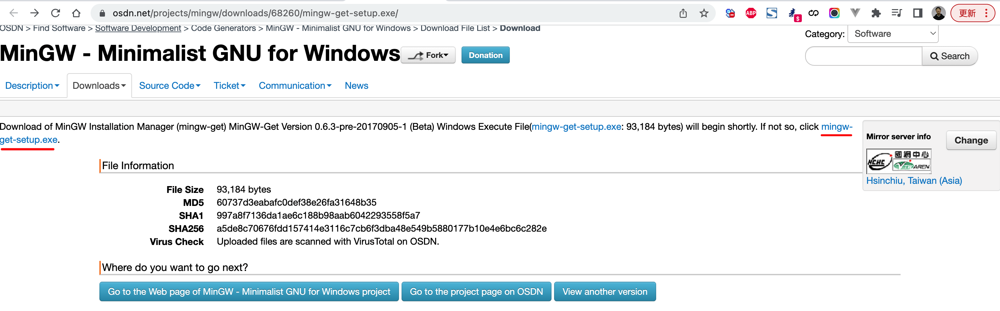

  

  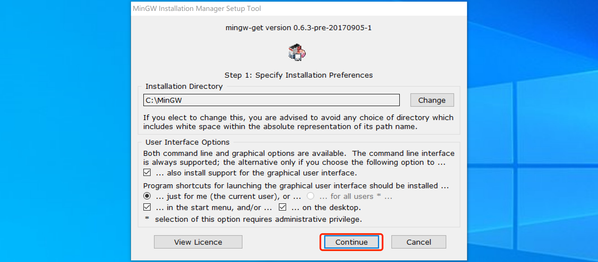

  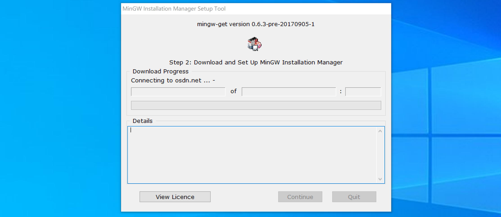

  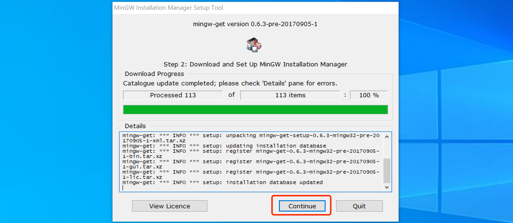

  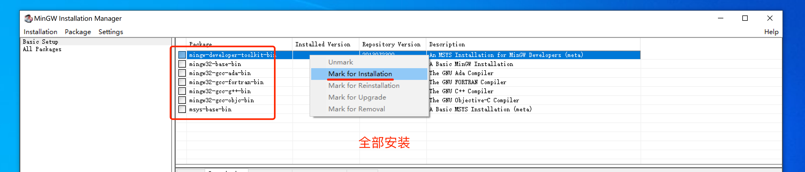

  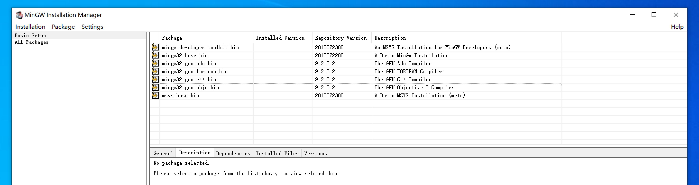

  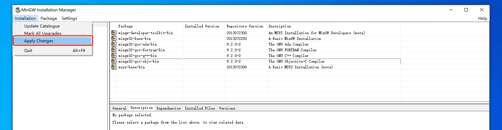

  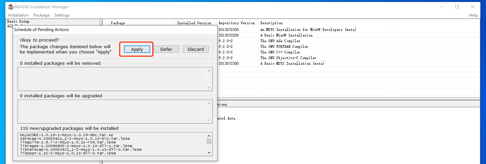

  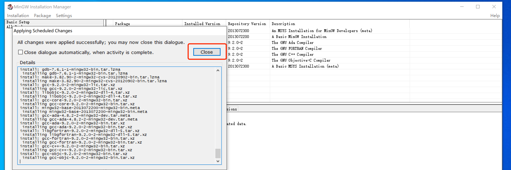

  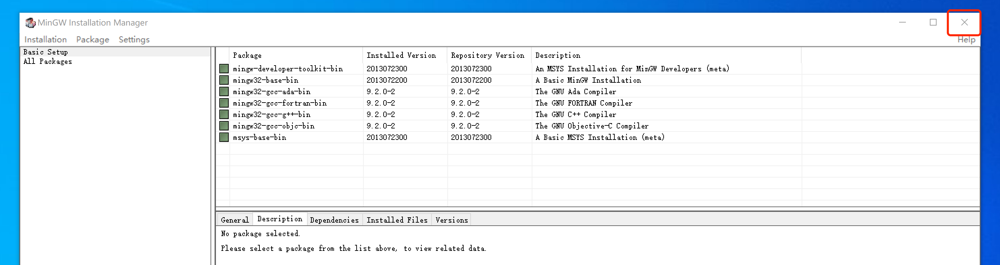

  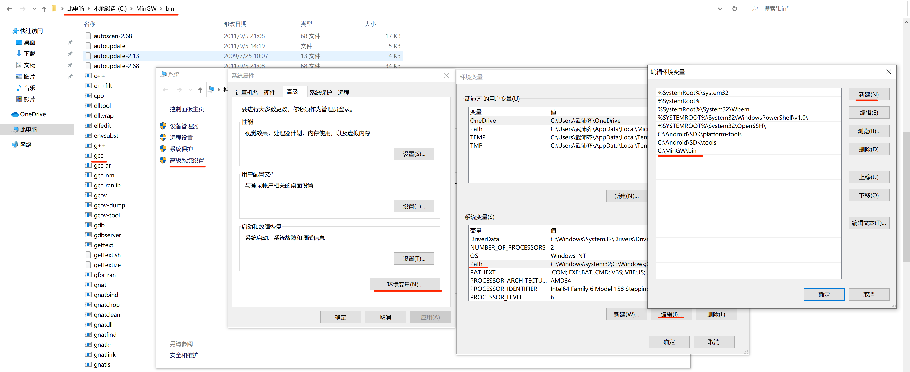

  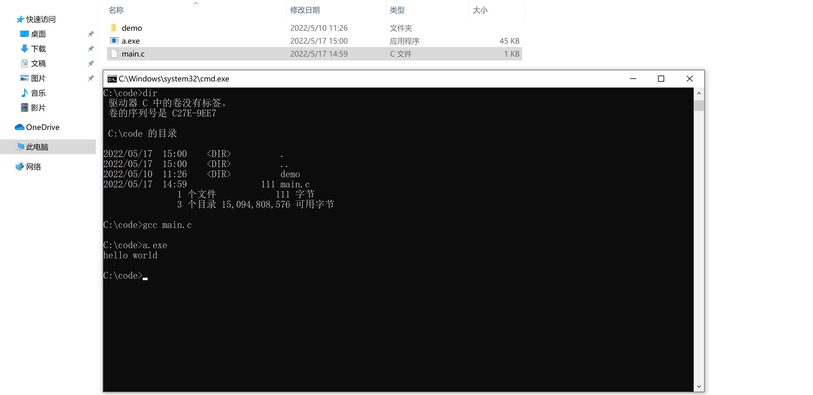


### 1.2 IDE

集成开发环境。

```
https://www.jetbrains.com/clion/download/other.html

- 以前：2020.1版本，破解容易。
- 现在：2022.1.1版本
```

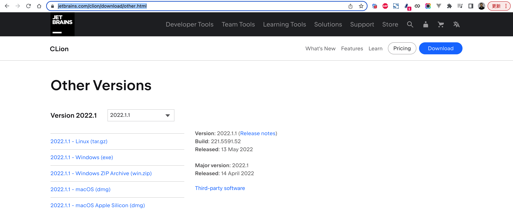


最新jetbrains 激活工具分享，见附件：【 **jetbrains激活.zip** 】


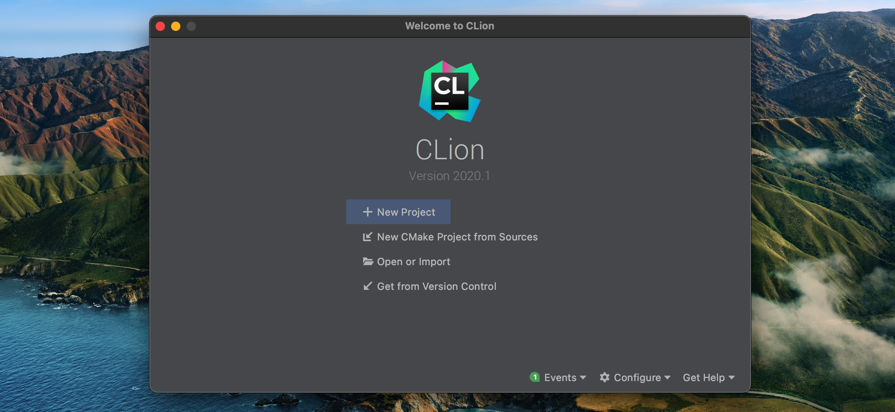

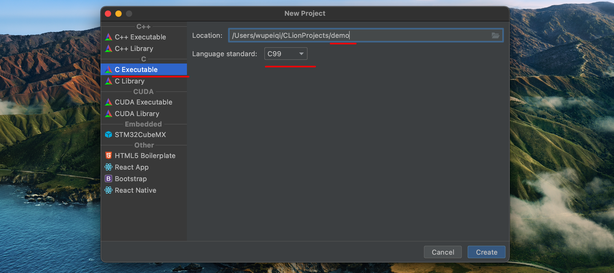

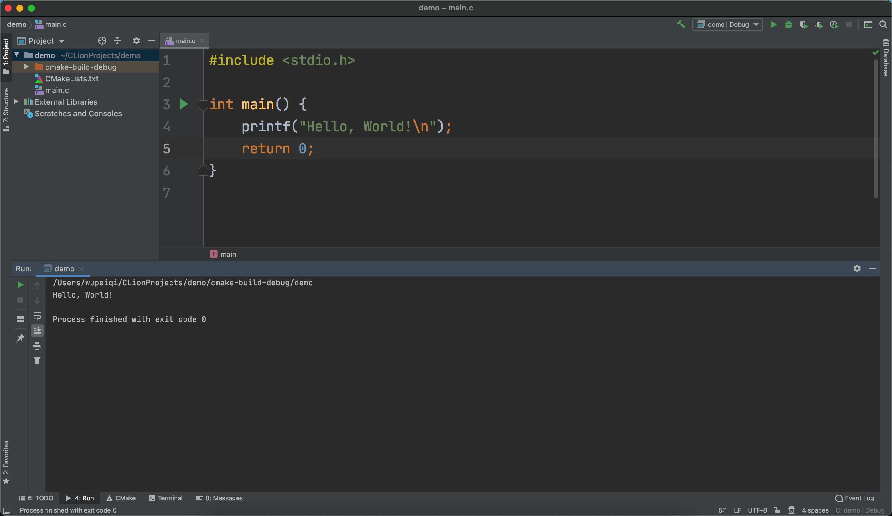


## 2.语法基础


### 2.1 字符串相关

**在C语言中没有字符串。**

用 **字符数组** 创造出字符串出来（每个字符占1个字节）。

```C
#include <stdio.h>

int main() {

    char v1 = 'w';

    char v2[4] = {'w', 'u', 'p', '\0'};  // "wup"

    char v3[] = "wupeiqi"; // {'w','u','p'...,'i','\0'}

    char v4[] = "武沛齐";  // x1 x2 x3

    printf("Hello, World!\n");

    return 0;
}
```


```c
# include <stdio.h>
# include <string.h>

int main(int argc, char const *argv[])
{
    // 字符类型，用1个字节来存储。
    char v1 = 'w';
    printf("v1的值为： %c\n", v1);

    // 字符数组 -> 字符串
    char v2[8] = {'w','u','p','e','i','q','i','\0'};
    printf("v2的值为： %s\n", v2);

    // 字符数组， sizeof大小
    char v3[] = "wupeiqi";
    int length = sizeof(v3)/sizeof(char);
    printf("v3的值为： %s，长度为：%d\n", v3, length);

    // 字符数组
    char v4[] = "武沛齐";
    int len = sizeof(v4)/sizeof(char);
    printf("v4的值为： %s，长度为：%d\n", v4, len);
	
    // 字符串长度
    unsigned long dataLen = strlen(v4);
    printf("Length: %d\n", dataLen);
    
    return 0;
}
```


### 2.2 数组

对于**数组**来说，内部元素是挨个存放，内存地址相邻。

- 元素固定
- 类型固定（每个元素在内存中占据长度相同）

```C
#include <stdio.h>

int main() {

    // char v1[8] = {'w', 'u', 'p', 'e', 'i', 'q', 'i', '\0'};
    char v3[] = "wupeiqi";
    printf("第0个位置值：%c，内存地址：%p \n", v3[0], &v3[0]); // 值所在的内存地址 0x00001
    printf("第1个位置值：%c，内存地址：%p \n", v3[1], &v3[1]); // 0x00002
    printf("第2个位置值：%c，内存地址：%p \n", v3[2], &v3[2]); // 0x00003

    return 0;
}
```


```c
# include <stdio.h>

int main(int argc, char const *argv[]) {
    int v3[] = {11, 22, 33, 44, 55, 66};  // 每个整型4字节
    printf("第0个位置值：%d，内存地址：%p \n", v3[0], &v3[0]); // 值所在的内存地址 0x00000
    printf("第1个位置值：%d，内存地址：%p \n", v3[1], &v3[1]); // 0x00004
    printf("第2个位置值：%d，内存地址：%p \n", v3[2], &v3[2]); // 0x00008
    return 0;
}
```


**数组变量**，也是（指向）也是数组第一个元素的内存地址。

```c
# include <stdio.h>

int main(int argc, char const *argv[]) {

    // 字符数组
    char v3[] = {'w', 'u', 'p', 'e', 'i', 'q', 'i'};
    printf("v3的值为： %p \n", v3);
    printf("v3的值为： %p \n", &v3);
    printf("v3的值为： %p \n", &v3[0]);
    printf("v3的值为： %p \n", &v3[1]);

    return 0;
}
```

```
v3的值为： wupeiqi 
v3的值为： 0x7ff7baca8670 
v3的值为： 0x7ff7baca8670 
v3的值为： 0x7ff7baca8670 
v3的值为： 0x7ff7baca8671 
```


```c
# include <stdio.h>

int main(int argc, char const *argv[]) {

    // 整型数组
    int v3[] = {11, 22, 33, 44, 55};
    printf("v3的值为： %p \n", v3);
    printf("v3的值为： %p \n", &v3);
    printf("v3的值为： %p \n", &v3[0]);
    printf("v3的值为： %p \n", &v3[1]);

    return 0;
}
```

```
v3的值为： 0x7ff7bf3e6670 
v3的值为： 0x7ff7bf3e6670 
v3的值为： 0x7ff7bf3e6670 
v3的值为： 0x7ff7bf3e6674 
```


### 2.3 整型相关

- short	2字节
- int         4字节
- long      8字节

```c
# include <stdio.h>

int main(int argc, char const *argv[]) {

    // 字符数组
    // signed short v4[] = {11, 22, 33};  //默认
    // unsigned short v4[] = {11, 22, 33};
    
    short v4[] = {-11, 22, 33};
    printf("值：%d，内存地址：%p\n", v4[0], &v4[0]);
    printf("值：%d，内存地址：%p\n", v4[1], &v4[1]);

    return 0;
}
```

```
值：11，内存地址：0x7ff7bb15e66a
值：22，内存地址：0x7ff7bb15e66c
```


### 2.4 指针


```C
int v1 = 666;

int* v2 = &v1;   // 取地址符，得到是 指针类型（64位操作系统，8字节）。
```

```c
#include <stdio.h>

int main() {

    int v1 = 666;
    int* v2 = &v1;

    printf("v1对应的值：%d，内存地址是：%p \n", v1, &v1);
    printf("v2对应的值：%p，内存地址是：%p \n", v2, &v2);

    return 0;
}
```

```
v1对应的值：666，内存地址是：0x7ff7b3d08678 
v1对应的值：0x7ff7b3d08678，内存地址是：0x7ff7b3d08670 
```


示例1：

```c
#include <stdio.h>

int main() {

    char v1 = 'x';
    char* v2 = &v1;


    printf("v1对应的值：%c，内存地址是：%p \n", v1, &v1);
    printf("v1对应的值：%p，内存地址是：%p \n", v2, &v2);

    return 0;
}

```

```
v1对应的值：x，内存地址是：0x7ff7b45e567b 
v1对应的值：0x7ff7b45e567b，内存地址是：0x7ff7b45e5670 
```


示例2：


```
int v1 = 666;
int* v2 = &v1;


如果你有一个指针类型的变量v2，内部存储肯定是内存地址，如何获取次内存地址中存储的值呢？
int v3 = *v2; // 666
```

注意：`&变量`，获取变量指向数据的内存地址。`*变量`，根据变量中存储的内存地址去获取次内存地址中存储的值。

```c
int v1 = 666;
&v1  ---> 获取他的内存地址，指针类型保存。
```

```c
int *v2 = &v10;
*v2  ---> 获取v2对应内存中存储的真正数据
```


示例3：

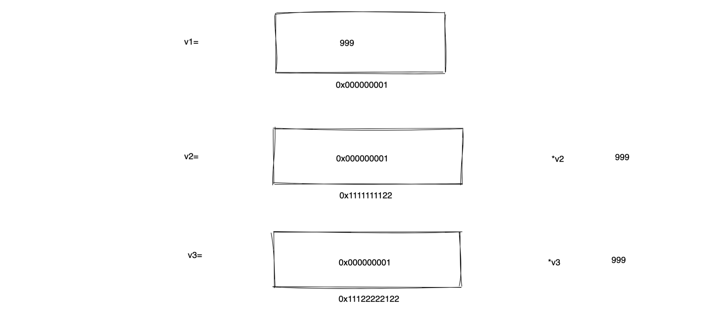

```c
#include <stdio.h>

int main() {

    int v1 = 666;
    int *v2 = &v1;
    int *v3 = &v1;

    v1 = 999;
	    
    printf("v2指针关联的值：%d \n", *v2); //
    printf("v3指针关联的值：%d \n", *v3); //

    return 0;
}
```


示例4：

```C
#include <stdio.h>


int main() {
    int v1 = 666;
    printf("v1的值是%d，v1的内存地址：%p \n", v1, &v1);

    v1 = 999;
    printf("v1的值是%d，v1的内存地址：%p \n", v1, &v1);
    return 0;
}
```

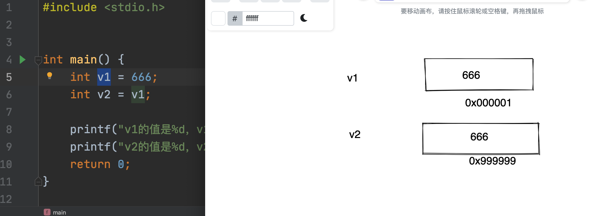


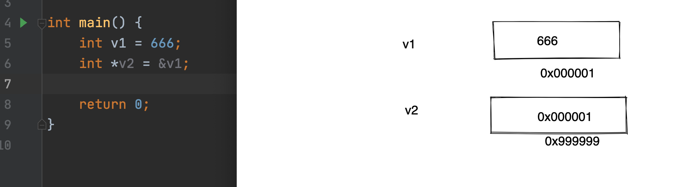


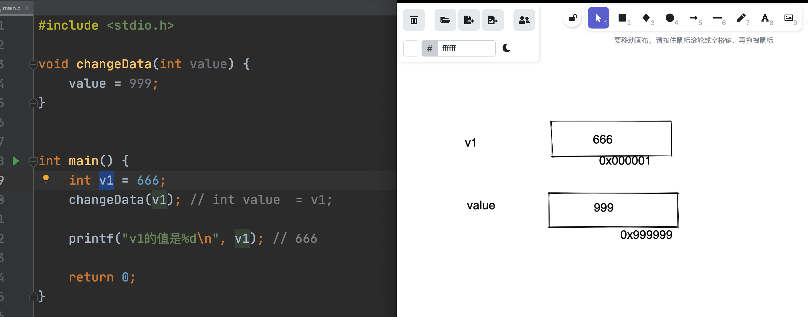


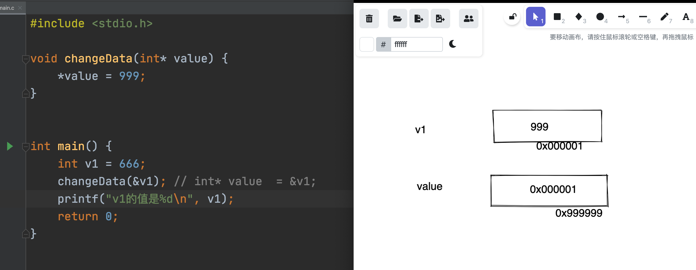

```c
int* v1 = &xxx;

*v1
*v1 = 999;
```


以后在分析别人的C语言代码时，你一定要当心。

```c
v1 = 123;
doEncrypt(&v1);  

# 后面v1的值很可能已经发生变化了。
```

```c
v1 = 123;
doEncrypt(v1);  

# v1一定还是123
```


小结：

- 指针本质上是一种数据类型，用于表示某种数据的内存地址，可以实现让多个变量指向同一个值。

  ```
  int*
  char*
  short*
  ```

- 两个关键字符

  ```
  &
  *
  ```

- 一个指针占8个字节


#### 案例（含6个示例）

示例1：

```c
#include <stdio.h>

int main() {

    char v34[] = {'a', 'e', 'x'};
    char *v28 = v34;
    //char *v28 = &v34;

    printf("v34的值：%c，内存地址：%p \n", v34[0], &v34[0]);
    printf("v34的值：%c，内存地址：%p \n", v34[1], &v34[1]);
    printf("v34的值：%c，内存地址：%p \n", v34[2], &v34[2]);
    
    // v28是指针类型，存储元素的内存地址  0x7ff7bebbe679
    printf("v28的值：%p \n", v28);
    
    v28 += 1;
    // v28是指针类型，存储元素的内存地址  0x7ff7bebbe67a
    printf("v28的值：%p \n", v28);
    
    v28 += 1;
    // v28是指针类型，存储元素的内存地址  0x7ff7bebbe67b
    printf("v28的值：%p \n", v28);
    return 0;
}
```

```
v34的值：a，内存地址：0x7ff7bebbe679 
v34的值：e，内存地址：0x7ff7bebbe67a 
v34的值：x，内存地址：0x7ff7bebbe67b 
v28的值：0x7ff7bebbe679
v28的值：0x7ff7bebbe67a 
v28的值：0x7ff7bebbe67b 
```


示例2：

```c
#include <stdio.h>

int main() {

    char v34[] = {'a', 'e', 'x'};
    char *v28 = v34;
    //char *v28 = &v34;

    printf("v34的值：%c，内存地址：%p \n", v34[0], &v34[0]);
    printf("v34的值：%c，内存地址：%p \n", v34[1], &v34[1]);
    printf("v34的值：%c，内存地址：%p \n", v34[2], &v34[2]);
    
    printf("v28的值：%p，对应地址的值：%c \n", v28, *v28);
    v28 += 1;
    printf("v28的值：%p，对应地址的值：%c \n", v28, *v28);
    v28 += 1;
    printf("v28的值：%p，对应地址的值：%c \n", v28, *v28);
    return 0;
}
```

```
v34的值：a，内存地址：0x7ff7b1082679 
v34的值：e，内存地址：0x7ff7b108267a 
v34的值：x，内存地址：0x7ff7b108267b 
v28的值：0x7ff7b1082679，对应地址的值：a 
v28的值：0x7ff7b108267a，对应地址的值：e 
v28的值：0x7ff7b108267b，对应地址的值：x 
```


```c
#include <stdio.h>

int main() {

    int v34[] = {11, 22, 33};
    int *v28 = v34;
    
    printf("v28的值：%p，对应地址的值：%d \n", v28, *v28);
    v28 += 1;
    printf("v28的值：%p，对应地址的值：%d \n", v28, *v28);
    v28 += 1;
    printf("v28的值：%p，对应地址的值：%d \n", v28, *v28);
    return 0;
}
```

```
v28的值：0x7ff7b430d67c，对应地址的值：11 
v28的值：0x7ff7b430d680，对应地址的值：22 
v28的值：0x7ff7b430d684，对应地址的值：33 
```


示例3：

```c
#include <stdio.h>

int main() {

    char v34[] = {'a', 'e', 'x'};
    char *v28 = v34;
    //char *v28 = &v34;

    v28 += 1;
    
    *v28 = 'b';

    printf("v34的值：%c，内存地址：%p \n", v34[0], &v34[0]);
    printf("v34的值：%c，内存地址：%p \n", v34[1], &v34[1]);
    printf("v34的值：%c，内存地址：%p \n", v34[2], &v34[2]);

    return 0;
}
```

```
v34的值：a，内存地址：0x7ff7b9d30679 
v34的值：b，内存地址：0x7ff7b9d3067a 
v34的值：x，内存地址：0x7ff7b9d3067b 
```


示例4：

```c
#include <stdio.h>

int main() {
    char v34[3]; // [d,s,b,]
    
    char *v28 = &v34;
	
    // 格式化
    sprintf(v28, "%c", 'd');

    v28 += 1;
    sprintf(v28, "%c", 's');

    v28 += 1;
    sprintf(v28, "%c", 'b');

    printf("值为：%s", v34);

    return 0;

}
```

```
值为：dsb
```


示例5：

```c
#include <stdio.h>

int main() {
    char v34[10]; // ['6','1', '7',,,,]
    char *v28 = v34;
    
    // 格式化：
    sprintf(v28, "%02x", 'a'); // 'a' -> ascii 97  ->  "61" -> ['6','1']

    v28 += 2;
    sprintf(v28, "%02x", 's'); // 115

    v28 += 2;
    sprintf(v28, "%02x", 'b'); // 98

    printf("值为：%s", v34);

    return 0;

}
```

```
值为：617362
```


示例6：

```c
#include <stdio.h>

int main() {
    char v34[80]; //[6,1,,,,,]
    char *v28;
    v28 = (char *) &v34;  // v28 = v34;
    // char *v28 = &v34;
    
    char v36[] = {'a', 'b', 'c', 'd', 'e', 'f', 'g'};
    
    int v29 = 0;
    do {
        sprintf(v28, "%02x", v36[v29++]); //  'a'
        v28 += 2;
    } while (v29 != 7);

    printf(v34);
    return 0;

}
```

```
61626364656667
```


#### 案例（含2个示例）

示例1

```c
#include <stdio.h>
#include <string.h>

int main() {
    char name[] = "wupeiqi";
    
    // 判断是name中是否存在子序列pe
    char *res = strstr(name, "pe");
    if (res == NULL) {
        printf("不存在");
    }else{
        printf("存在，从位置 %p 匹配成功的\n",res);
    }

    return 0;

}
```


示例2

```c
#include <stdio.h>
#include <string.h>

int main() {
    char name[] = "wupeiqi";
    printf("原来的的内容为：%s，内存地址：%p\n", name, name);


    char *newName;
    strcpy(newName, name); // 拷贝
    printf("拷贝后的内容为：%s，内存地址：%p\n", newName, newName);
    return 0;
}
```


#### 案例（含3个示例）

示例1

```c
#include <stdio.h>
#include <string.h>

int main() {
    char name[] = "alex";
    char role[] = "sb";

    char result[7]; //[,,,,,,,,,,,,]

    strcat(result, name);
    strcat(result, role);
    printf("最终的值为：%s\n", result);  // alexsb

    return 0;
}
```


示例2

```c
#include <stdio.h>
#include <string.h>
#include<stdlib.h>

int main() {
    char name[] = "alex";
    char role[] = "sb";

    char *result = malloc(strlen(name) + strlen(role) + 1);
    strcat(result, name);
    strcat(result, role);
    printf("最终的值为：%s\n", result); //alexsb

    return 0;
}
```


示例3

```c
#include <stdio.h>
#include <string.h>
#include<stdlib.h>


int main() {
    char name[] = "alex";
    char role[] = "sb";

    char *v23 = malloc(strlen(name) + strlen(role) + strlen(name) + 1);
    strcpy(v23, name);
    strcat(v23, role);// "alexsb"

    char *v24 = v23;
    strcat(v24, name);
    
    printf(v23);
    return 0;
}
```


### 2.5 指针的指针

白话指针，内部存储了一个别人的数据的内存地址。

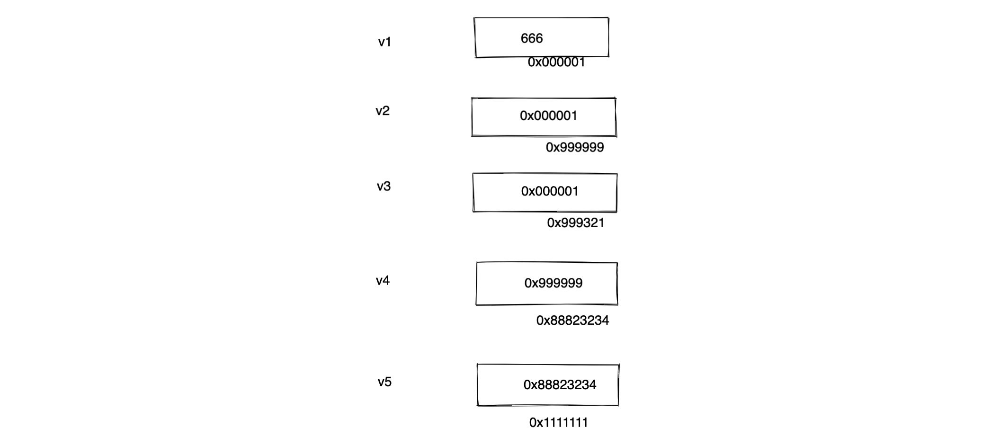

```c
int v1 = 666;

int* v2 = &v1;     // *v2

int* v3 = &v1;    //  *v3

int** v4 = &v2;  // 指针的指针   //  **v4

int*** v5 = &v4;  // 指针的指针  ***v5
```


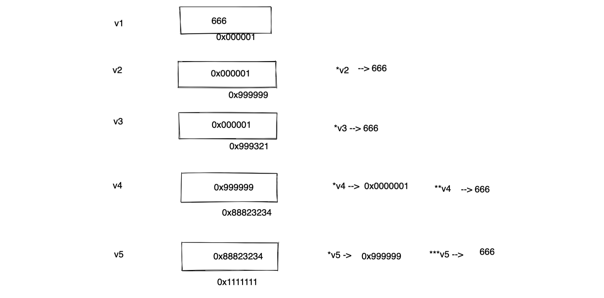


本质上，指针其实就是咱们说的根据内存地址对数据进行操作。


### 2.5 结构体

表示一组数据，利用结构体来实现。

```c
#include <stdio.h>

struct Person {
    char name[30];
    int age;
};


int main() {
    struct Person v1 = {"alex", 18};
    struct Person v2 = {"路飞学城", 3};
    struct Person v3 = {"李杰", 31};

    printf("值是：%s", v1.name);
    return 0;
}
```

```c
#include <stdio.h>

struct Person {
    char name[30];
    int age;
};


int main() {

    struct Person v1 = {"alex", 18};
    printf("值是：%s \n", v1.name);

    struct Person *pp = &v1;  // pp是一个变量，他是一个指针类型。 *pp
    printf("值是：%s \n", (*pp).name);
    printf("值是：%s \n", pp->name);
    
    return 0;
}
```


#### 单向链表


```c
struct Node{
    int data;
    struct Node *next;
}

struct Node v3 = {33};
struct Node v2 = {22, &v3};
struct Node v1 = {11, &v2};


v1.data;        		// 11
v1.next->data;   		// 22
v1.next->next->data;    // 33
```

```c
# include <stdio.h>

struct Person
{
    int data;
    struct Person *next;
};

int main(int argc, char const *argv[])
{   
    struct Person p3 = { 33 };
    struct Person p2 = { 22, &p3 };
    struct Person p1 = { 11, &p2 };
    
    printf("p1的值: %d\n", p1.data);
    printf("p2的值: %d\n", p1.next->data);
    printf("p3的值: %d\n", p1.next->next->data);

    return 0;
}
```

注意：将数组时，里面的每个元素都是连续的；构造一个动态的容器。


#### 双向链表


```c
# include <stdio.h>

struct Person
{
    int data;
    struct Person *next;
    struct Person *prev;
};

int main()
{   
    struct Person p3 = { 33 };
    struct Person p2 = { 22 };
    struct Person p1 = { 11 };
    
    p1.next = &p2;

    p2.next = &p3;
    p2.prev = &p1;

    p3.prev = &p2;

    printf("p1的值: %d\n", p1.data);
    printf("p2的值: %d\n", p1.next->data);
    printf("p3的值: %d\n", p1.next->next->data);

    printf("p3的值: %d\n", p3.data);
    printf("p2的值: %d\n", p3.prev->data);
    printf("p1的值: %d\n", p3.prev->prev->data);

    return 0;
}
```


#### 双向环状链表

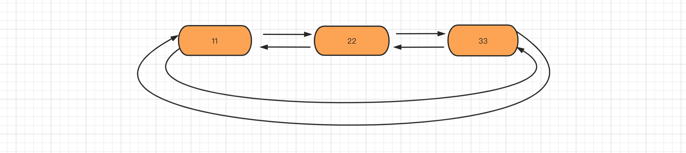

```c
# include <stdio.h>

struct Person
{
    int data;
    struct Person *next;
    struct Person *prev;
};

int main()
{   
    struct Person p3 = { 33 };
    struct Person p2 = { 22 };
    struct Person p1 = { 11 };
    p1.next = &p2;
    p1.prev = &p3;

    p2.next = &p3;
    p2.prev = &p1;

    p3.prev = &p2;
    p3.next = &p1;

    printf("p1的值: %d\n", p1.data);
    printf("p2的值: %d\n", p1.next->data);
    printf("p3的值: %d\n", p1.next->next->data);

    printf("p1的值: %d\n", p1.next->next->next->data);
    printf("p2的值: %d\n", p1.next->next->next->next->data);
    printf("p3的值: %d\n", p1.next->next->next->next->next->data);

    return 0;
}
```


### 2.6 预处理和头文件

 预处理，在程序编译之前会先运行的。

```c
# include <stdio.h>

# define ME  200
# define SIZE  18

int main() {
    int data = 19;

    printf("%d-%d-%d \n", ME, SIZE, data);
    return 0;
}
```


```c
# include <stdio.h>

# define ADD(x1, x2)(x1+x2+100)

int main() {
    int data = ADD(11, 22); // 11+22+100
    printf("结果：%d \n", data);
    return 0;
}
```

```c
# include <stdio.h>

# define DB(x1, x2)(x1*x2)

int main() {
    int data = DB(2 + 1, 4);  // 2+1*4 = 6
    printf("结果：%d \n", data);
    return 0;
}
```


```
项目目录
├── main.c
├── utils.c
└── utils.h
```

```c
// utils.h

int plus(int v1);
```

```c
// utils.c

int plus(int v1){
    return v1 + 100;
}
```

```c
# include <stdio.h>
# include "utils.h"

int main() {
    int data = plus(100);
    printf("结果：%d \n", data);
    return 0;
}
```


比如后期，我们要进行JNI开发时，我们会在自己的c文件用去引入C语言中提供、JNI中提供一些头文件，才能使用头文件中的功能。


